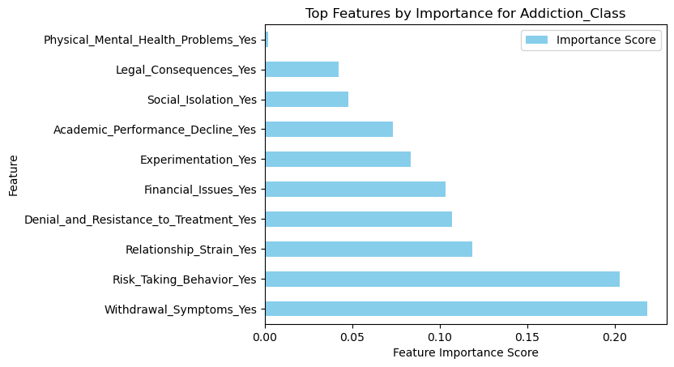

# Substance Abuse Risk Prediction: Survey Effectiveness Analysis

## Table of Contents
1. [Business Understanding](#business-understanding)
2. [Data Understanding](#data-understanding)
3. [Data Preparation](#data-preparation)
4. [Modeling](#modeling)
5. [Evaluation](#evaluation)

## Business Understanding
The purpose of this project is to support healthcare professionals, policymakers, and researchers in identifying which survey provides the best foundation for detecting substance abuse risk. We evaluate and compare two different survey datasets—each with a distinct focus—to determine which is better suited for identifying individuals at risk. By understanding the effectiveness of these surveys, stakeholders can make informed decisions about early intervention programs and improve survey design for future assessments.

## Data Understanding
Substance abuse is a significant public health issue that requires proactive identification and support for individuals at risk. One effective approach is to use survey data to detect patterns and indicators of substance abuse risk. In this project, we analyze two survey datasets:
1. **PRLMIS Data**: This dataset includes information from a broad health survey covering physical health, mental health, demographics, and drug use indicators.
2. **Student Addiction Data**: Focused on younger individuals, this dataset captures data on behavioral indicators, academic performance, and social influences.


Our main question is: **Which survey provides a stronger foundation for predicting substance abuse risk?** Our findings can guide future survey design and data collection efforts to enhance early detection.

### Data Limitations
Each dataset has its own limitations for predicting substance abuse risk. The **PRLMIS dataset** covers a broad range of health indicators but is self-reported, which may lead to biases such as underreporting. It also lacks specific social and behavioral insights, which are often important in understanding risk. Meanwhile, the **Student Addiction dataset** focuses on behavioral and social indicators but lacks _detailed_ health history such as exact substances used, frequency of usage, or mental health history , limiting its ability to provide a comprehensive picture of risk factors.

## Data Preparation
To make the datasets suitable for predicting substance abuse risk, we took several steps:
1. **Feature Selection**: We identified the 10 most relevant indicators from each dataset to focus on factors most likely to predict risk.
2. **Handling Missing Values**: Some records in the Student Addiction dataset were incomplete. Since these accounted for only a small portion, we removed them to maintain data quality.
3. **Transforming Data for Modeling**: We organized the data to ensure consistency across both datasets, making it easier for machine learning models to analyze them.




## Modeling
To determine which dataset better predicts substance abuse risk, we built several machine learning models and tested them on each dataset. These models include:
1. **Logistic Regression**: A straightforward model that assesses each factor individually to make predictions. This model helped establish a baseline for each dataset’s predictive power.
2. **Random Forest with Weighted Classes**: This model uses multiple “decision paths” and places more emphasis on at-risk cases, helping to improve the identification of individuals at risk.
3. **XGBoost with Adjusted Thresholds**: A more advanced model that can recognize complex patterns. We also adjusted the threshold to make the model more sensitive to high-risk cases.

Each model was tuned and tested to balance accuracy with the need to catch as many at-risk individuals as possible.

## Evaluation
We evaluated each model based on its ability to correctly identify both “at-risk” and “not at-risk” cases, using several key metrics:
- **Recall**: Measures how well the model identifies actual at-risk cases, which is crucial for early intervention.
- **Precision**: Shows how often the model's predictions of “at-risk” are correct, reducing unnecessary misidentification.
- **Accuracy**: Provides an overall measure of how many cases the model classified correctly.


Through visual tools, such as bar charts comparing accuracy, recall, and precision, we observed that the **PRLMIS dataset consistently provided better prediction results**, making it a more reliable tool for identifying substance abuse risk.


The analysis revealed that the **PRLMIS dataset offers a more effective foundation for predicting substance abuse risk**. Its broader range of health and demographic factors allowed for higher accuracy and recall, making it a more suitable dataset for early risk identification.

### Recommendations
Based on these findings, we recommend:
1. **Using PRLMIS as the primary tool** for substance abuse risk assessments, especially for general population screenings.
2. **Refining the PRLMIS survey** to add social and behavioral indicators for even better predictive power.
3. **Designing future surveys** to combine health, social, and behavioral factors, drawing from the strengths of both datasets.

### Future Applications
Stakeholders can use the final model as a foundation for:
- **Early intervention programs**: Identifying individuals early to provide resources and support.
- **Improving survey design**: Using insights from the PRLMIS structure to capture a more comprehensive picture of substance abuse risk factors.
- **Continuous model improvement**: As more data is collected, the model can be retrained and refined, leading to even more accurate predictions over time.

This project provides a robust approach to understanding and predicting substance abuse risk, with the potential to inform future surveys and strengthen early intervention efforts.


---


---

### Reproducibility Guide

To ensure this project is fully reproducible, please follow the steps below.


#### Software and Environment Setup

This project was developed using:
- **Python** 3.8 or higher
- **Jupyter Notebook**
- Other Python libraries as listed in `requirements.txt`

To recreate the environment and install dependencies, follow these steps:

1. **Clone the repository** (replace `substance_abuse_risk.ipynb` with the actual URL):
   ```bash
   git clone substance_abuse_risk.ipynb
   cd substance_abuse_risk
e`

#### Data Download

To use this project, you need access to the dataset required for the analysis. Please follow these instructions:

1. **Download the Data File**: If the dataset is not available publicly, contact the project owner or the data administrator to obtain access. 

2. **Save the Data File in the Correct Directory**:
   - Place the data file in the following directory structure within the repository:

     ```
     substance_abuse_risk/
     ├── data/
     │   └── raw_data.csv  # Replace `raw_data.csv` with the actual filename
     ```

3. **Download Data with a Command (Optional)**: 
   - If the data is publicly available online, you can download it directly to the correct folder by using the following command in your terminal 

     ```bash
     curl -o data/raw_data.csv data_url
     ```

Make sure the data file is in the correct location before proceeding to run the analysis.

4. **Run the Jupyter Notebook:**

 - Open Jupyter Notebook:
   - bash
   - Copy code
   - jupyter notebook
   - Open substance_abuse_risk.ipynb and run all cells.


## 🔄 Navigation


- [Business Understanding](#business-understanding)
- [Data Understanding](#data-understanding)
- [Data Preparation](#data-preparation)
- [Modeling](#modeling)
- [Evaluation](#evaluation)
- [Conclusion](#conclusion)
- [Reproducibility Guide](#reproducibility-guide)


